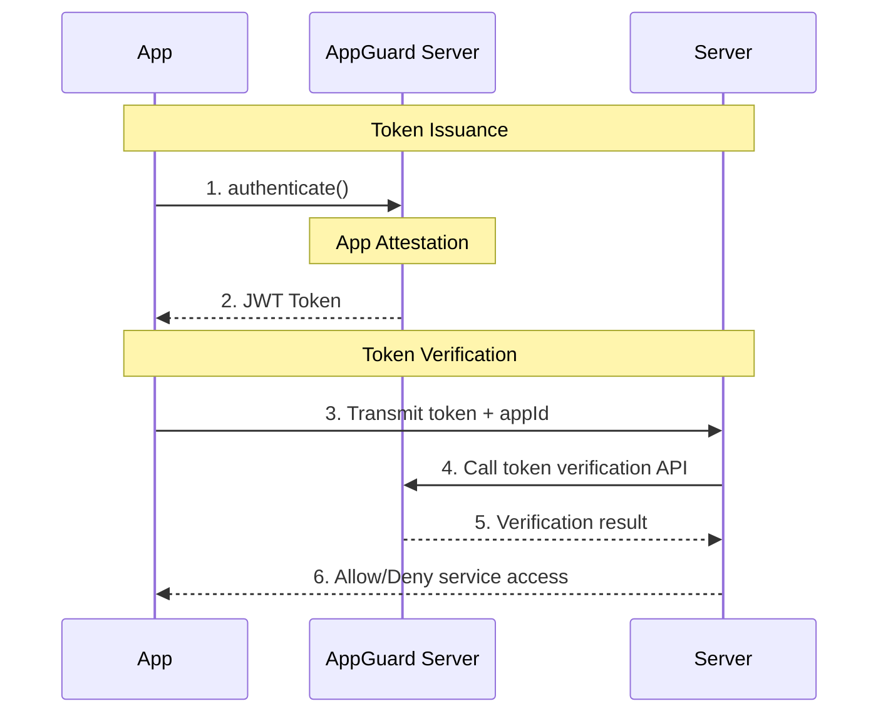

<!-- machine_translated: true -->

<!-- pre-align:aligned sig=dbacc26b661d -->

# App Attestation Guide

## Overview { #overview }

NHN AppGuard's **App Attestation** provides a means to verify whether an app has been tampered with and whether the execution environment is secure on the server side, and to control access so that only apps that pass verification can access the service.

## How It Works { #how-it-works }

When an app requests app attestation, the AppGuard server performs the verification and issues the result as a token. The issued token is then transmitted to the server for verification.

## How to Apply { #how-to-apply }

### Step 1: Protect the App Using the CLI { #step-1-protect-the-app-using-the-cli }

Protect the APK/AAB file using `appguard-cli`.

→ [2.1 Protection Using CLI]({{ cli_page }})

### Step 2: Configure App Attestation Settings in the Console { #step-2-configure-app-attestation-settings-in-the-console }

Register the app's signature information and configure app attestation options in the web console.

→ [6.2 Console App Attestation Settings](console.md)

### Step 3: Use App Attestation { #step-3-use-app-attestation }

Use the SDK in the app code to obtain an app attestation token.

→ [6.3 How to Use App Attestation](sdk.md)

### Step 4: Verify the Token on the Server { #step-4-verify-the-token-on-the-server }

Transmit the issued token to the server, and call the AppGuard token verification API on the server to check the attestation result.

---

