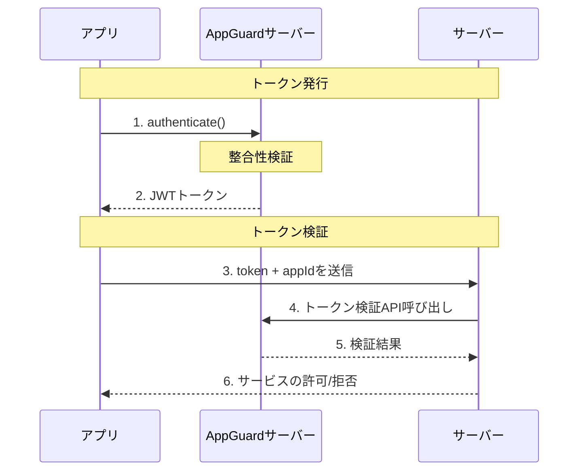

<!-- pre-align:aligned sig=dbacc26b661d -->

# アプリ証明ガイド

## 概要 { #overview }

NHN AppGuardの**アプリ証明(App Attestation)**は、アプリの改ざんの有無と実行環境の安全性をサーバーで検証し、検証に成功したアプリのみサービスへアクセスできるように制御する機能を提供します。

## 動作フロー { #how-it-works }

アプリでアプリ証明をリクエストすると、AppGuardサーバーで検証を実行し、結果をトークンとして発行します。発行されたトークンをサーバーへ送信して検証します。

## 適用手順 { #how-to-apply }

### 1段階：CLIでアプリ保護 { #step-1-protect-the-app-using-the-cli }

`appguard-cli`でAPK/AABファイルを保護します。

→ [2.1 CLIを利用した保護作業]({{ cli_page }})

### 2段階：コンソールでアプリ証明設定 { #step-2-configure-app-attestation-settings-in-the-console }

Webコンソールでアプリの署名情報を登録し、アプリ証明オプションを設定します。

→ [5.2 コンソールアプリ証明設定](console.md)

### 3段階：アプリ証明の使用 { #step-3-use-app-attestation }

アプリのコードでSDKを利用してアプリ証明トークンを取得します。

→ [5.3 アプリ証明の使用方法](sdk.md)

### 4段階：サーバーでトークン検証 { #step-4-verify-the-token-on-the-server }

発行されたトークンをサーバーへ送信し、サーバー側でAppGuardトークン検証APIを呼び出してアプリ証明の結果を確認します。

---

