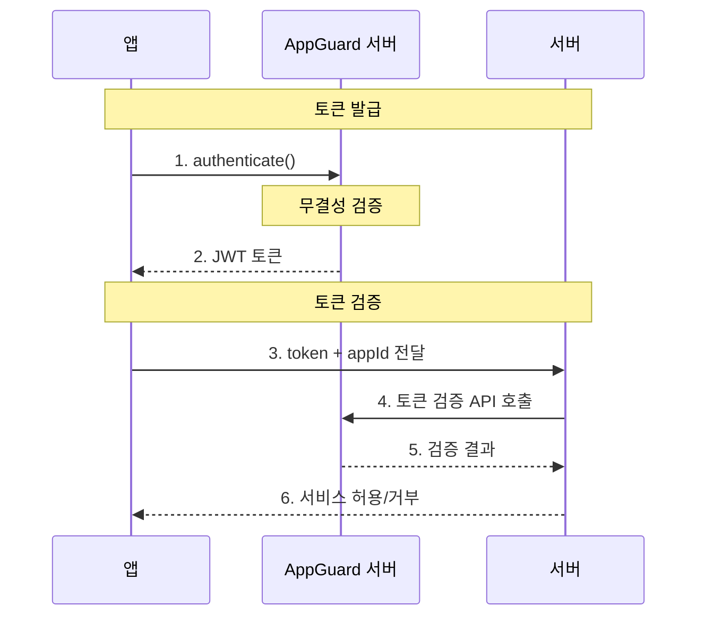

<!-- pre-align:aligned sig=dbacc26b661d -->

# 앱 증명 가이드

## 개요 { #overview }

NHN AppGuard의 **앱 증명(App Attestation)**은 앱의 위변조 여부와 실행 환경의 안전성을 서버에서 검증하고, 검증에 성공한 앱만 서비스에 접근할 수 있도록 제어할 수 있는 수단을 제공합니다.

## 동작 흐름 { #how-it-works }

앱에서 앱 증명을 요청하면 NHN AppGuard 서버에서 검증을 수행하고, 결과를 토큰으로 발급합니다. 발급 받은 토큰을 서버로 전달하여 검증합니다.

## 적용 절차 { #how-to-apply }

### 1단계: CLI로 앱 보호 { #step-1-protect-the-app-using-the-cli }

`appguard-cli`로 APK/AAB 파일을 보호합니다.

→ [2.1 CLI를 이용한 보호작업]({{ cli_page }})

### 2단계: 콘솔에서 앱 증명 설정 { #step-2-configure-app-attestation-settings-in-the-console }

웹 콘솔에서 앱의 서명 정보를 등록하고 앱 증명 옵션을 설정합니다.

→ [6.2 콘솔 앱 증명 설정](console.md)

### 3단계: 앱 증명 사용 { #step-3-use-app-attestation }

앱 코드에서 SDK를 이용하여 앱 증명 토큰을 발급 받습니다.

→ [6.3 앱 증명 사용법](sdk.md)

### 4단계: 서버에서 토큰 검증 { #step-4-verify-the-token-on-the-server }

발급 받은 토큰을 서버로 전달하고, 서버에서 NHN AppGuard 토큰 검증 API를 호출하여 앱 증명 결과를 확인합니다.

---

