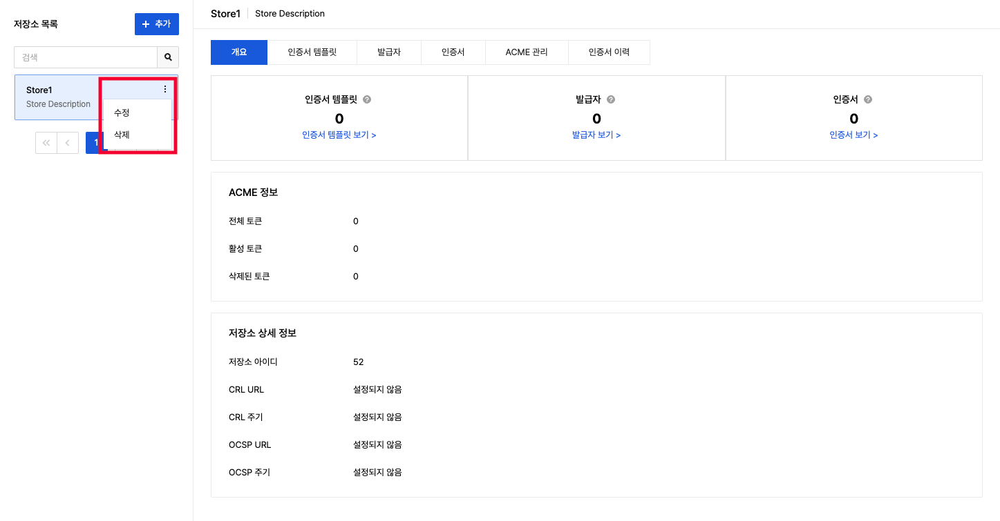

# 콘솔 사용 가이드
**Management > Private CA > 콘솔 사용 가이드**

Private CA 콘솔은 인증 기관(certificate authority, CA)을 중심으로 구성되어 있으며, 모든 리소스(인증서 템플릿, 발급자, 인증서, ACME 토큰)는 특정 저장소에 속합니다. 콘솔 화면은 왼쪽에 저장소 목록, 오른쪽에 선택한 저장소의 상세 정보를 표시하는 탭 구조로 되어 있습니다.

## Private CA 사용 흐름

Private CA에서 인증서를 발급 받기까지의 과정은 다음과 같습니다.

1. **저장소 생성**: 인증서를 관리할 공간을 만듭니다.
2. **발급자 생성**: 인증서에 서명할 인증 기관(CA)을 만듭니다.
    - Root CA: 최상위 인증 기관
    - Intermediate CA: Root CA 아래의 중간 인증 기관
3. **인증서 템플릿 생성**: 동일한 설정으로 여러 인증서를 발급할 때 사용합니다.
4. **인증서 발급**: 인증서 템플릿을 통해 실제 사용할 인증서를 발급 받습니다.

!!! tip "알아두기"
    - **CA(certificate authority, 인증 기관)**: 인증서를 발급하고 서명하는 주체입니다.
    - **Root CA**: 자체 서명한 최상위 인증서입니다. 모든 신뢰의 출발점입니다.
    - **Intermediate CA**: Root CA에 의해 서명된 중간 인증서입니다. 실제 서버 인증서 발급에 사용됩니다.

## 추가 이미지

